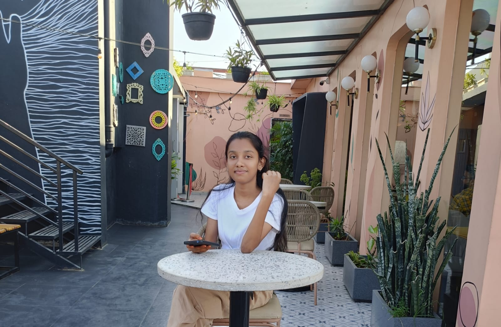

# 🎓 B.Tech Portfolio — Full Stack

Node.js + Express + SQLite backend with contact form and admin panel.

---


## 📁 Folder Structure

```
portfolio/
├── server.js          ← Backend server (run this)
├── package.json       ← Node dependencies
├── portfolio.db       ← Auto-created SQLite database
└── public/            ← All frontend files (served automatically)
    ├── index.html     ← Your portfolio website
    ├── style.css      ← All styles & animations
    ├── script.js      ← Frontend JavaScript
    └── admin.html     ← Admin dashboard
```

---

## 🚀 How to Run (3 steps)

**Step 1 — Install Node.js** (if not installed)
Download from: https://nodejs.org  → choose LTS version

**Step 2 — Install dependencies**
Open terminal in the `portfolio/` folder:
```bash
npm install
```

**Step 3 — Start the server**
```bash
npm start
```

Terminal will show:
```
✅ SQLite database connected (portfolio.db)
🚀  Server running  →  http://localhost:3000
🌐  Portfolio       →  http://localhost:3000/index.html
🔧  Admin Panel     →  http://localhost:3000/admin.html
🔑  Login           →  admin / admin123
```

Open your browser and go to **http://localhost:3000**

---

## 🔑 Admin Panel

URL: **http://localhost:3000/admin.html**

Default login:
- Username: `admin`
- Password: `admin123`

> ⚠️ **Change your password after first login** using the "Change Password" page!

### What you can do:
| Feature | Description |
|---------|-------------|
| Dashboard | See total messages + unread count |
| Messages | Read and delete contact form submissions |
| Change Password | Update your admin password securely |

---

## 🔌 API Endpoints

| Method | Route | Auth | Description |
|--------|-------|------|-------------|
| POST | /api/contact | ❌ | Submit contact form |
| POST | /api/admin/login | ❌ | Admin login → get token |
| GET | /api/admin/messages | ✅ | All messages |
| GET | /api/admin/messages/stats | ✅ | Total & unread count |
| PUT | /api/admin/messages/:id/read | ✅ | Mark as read |
| DELETE | /api/admin/messages/:id | ✅ | Delete message |
| PUT | /api/admin/change-password | ✅ | Change password |

---

## ✏️ Customize

1. **Your name**: Search `Your Name Here` in `index.html` and replace
2. **Initials**: Change `YN` to your initials in `index.html`
3. **Photo**: Replace the `oval-placeholder` div with:
   ```html
   
   ```
   Put `photo.jpg` inside the `public/` folder
4. **Links**: Update GitHub, LinkedIn, email links in `index.html`
5. **Colors**: Edit the `:root` block at the top of `style.css`
6. **JWT Secret**: Change `JWT_SECRET` in `server.js` before going live

---

## 🌐 Deploy Free Online

### Render.com (easiest)
1. Push folder to GitHub
2. Go to render.com → New Web Service → connect repo
3. Build command: `npm install`
4. Start command: `node server.js`
5. Done! Your portfolio is live.

### Railway.app
1. Push to GitHub
2. railway.app → New Project → Deploy from GitHub → auto-detected!

---

Built with Node.js · Express · SQLite · HTML · CSS · JS ✦
